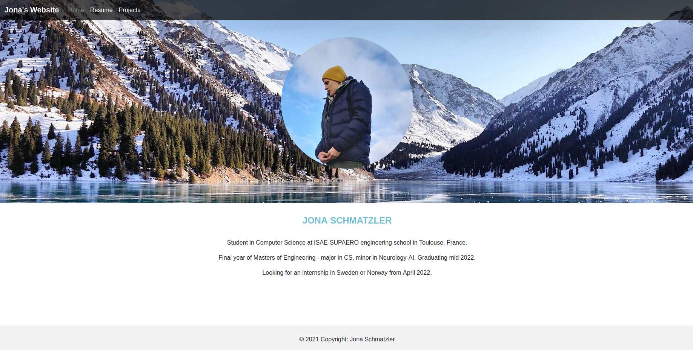

# django_site

This is the code for a resume-style Django-based website written entirely in Python and HTML. 

To launch it and visualize it, simply use the command `python manage.py runserver 8000` and access 127.0.0.1:8000 with any browser.

It looks like this:

